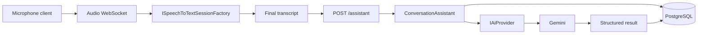

# Conversa

Conversa is an AI-powered conversation assistant for people who need to understand and take part in a spoken conversation in a foreign language.

The first scenario is a Turkish speaker listening to English:

1. The app receives a transcript of what the other person said.
2. The AI translates and, when useful, explains that speech in natural Turkish.
3. If the speaker asks the user a question, the AI can detect that.
4. When the active instruction allows it, the AI suggests a natural English reply and shows what that reply means in Turkish.
5. The user can also type a Turkish request and ask the AI to formulate it in natural English.

Conversa is not a generic translator. Every request is interpreted against the current conversation and that conversation's instruction. The instruction stays in force until the user changes it.

Example instruction:

> During this conversation, translate the English speaker's speech into natural and accurate Turkish. Unless I explicitly ask otherwise, only translate and explain what is being said.

Later, for the same conversation:

> From now on, also detect questions directed at me and suggest natural English answers.

The new instruction replaces the previous one for that conversation only.

## Current status

This repository is the first foundation step. It is a modular monolith, not a set of microservices, and it does not yet include a web or mobile client.

Working now:

- Conversation create, read, update, and delete, scoped to a user id
- Persistent instruction, title, and language pair on each conversation
- Changing the instruction during a conversation, with a system note in the transcript
- Message history that can be reopened later
- Assistant endpoint that sends the transcript, recent turns, and the active instruction to the AI
- Gemini provider behind `IAiProvider`, returning a structured result rather than free text
- Honest failure when the Gemini API key is missing (no fabricated translation)
- PostgreSQL persistence through Entity Framework Core, including the initial migration
- Speech-to-text and streaming-audio boundaries, with no vendor implementation yet
- WebSocket entry point for continuous listening that reports when speech-to-text is not configured

Not implemented yet:

- Authentication. `X-User-Id` is a temporary request header, not a security boundary
- Web and React Native clients
- A speech-to-text provider and the full microphone pipeline
- Production deployment, background workers, and multi-instance hosting
- A model snapshot for later `dotnet ef migrations add` diffs (see below)

## Architecture

One ASP.NET Core host. Domain rules stay in the domain project. Use cases live in the application project. PostgreSQL and Gemini live in infrastructure. The API project is the composition root.

```text
src/
  Conversa.Domain/            entities and invariants
  Conversa.Application/       use cases and provider interfaces
  Conversa.Infrastructure/    EF Core, Gemini, repositories
  Conversa.Api/               HTTP, WebSocket, composition root
```

Feature boundaries inside those projects:

| Module | Responsibility |
| --- | --- |
| Conversation | Persistent conversation, instruction, languages |
| Messages | Turns stored against a conversation |
| AI | Provider-neutral request and structured response |
| Speech-to-text | One-shot and streaming transcription contracts |
| Audio | Chunk shape used by the streaming boundary |
| Authentication | Not implemented. `ICurrentUser` is the seam |

Provider-specific prompt text and HTTP calls stay in `Conversa.Infrastructure`. Application code depends on `IAiProvider`, not on Gemini types.



The WebSocket does not invent transcripts. Until a speech-to-text provider is registered, it accepts the socket and returns `stt_provider_not_configured`. Final text is posted to the assistant endpoint, which loads the conversation instruction and recent messages before calling the AI.

## Technology stack

- .NET 10 / ASP.NET Core Web API
- C# with nullable reference types
- Entity Framework Core 10 and Npgsql for PostgreSQL
- React and React Native are planned, not in this repository
- Gemini as the first `IAiProvider`
- Speech-to-text is an interface only, so the vendor can be chosen later

## Domain

`Conversation`

- Id, UserId, Title, Instruction, SourceLanguage, TargetLanguage, CreatedAt, UpdatedAt

`Message`

- Id, ConversationId, Role, OriginalText, Translation, Explanation, SuggestedAnswer, SuggestedAnswerTranslation, CreatedAt
- Also stored, so a reopened conversation keeps the structured result: ResponseType, QuestionDetected, QuestionDirectedAtUser, ProviderName

Languages are BCP-47 tags (`en`, `tr`), not an English/Turkish enum. The AI model uses `Translation` for the target language. In the initial scenario that text is Turkish. The conceptual fields map like this:

| Conceptual field | Stored property |
| --- | --- |
| original | OriginalText |
| turkish | Translation |
| explanation | Explanation |
| suggestedAnswer | SuggestedAnswer |
| suggestedAnswerTurkish | SuggestedAnswerTranslation |
| type | ResponseType (`translation`, `question`, `answer`, `instruction`) |

`MessageRole` is `speaker` for overheard speech, `user` for a formulation request, and `system` for notes such as an instruction change.

## AI behavior

`POST /api/conversations/{id}/assistant` builds an `AiConversationRequest` from:

- the active instruction
- source and target languages
- the latest text
- the input kind: `heardSpeech` or `userFormulationRequest`
- the latest conversation turns

Gemini is asked for JSON that matches a fixed schema. The parser rejects empty or non-JSON results. It does not fill in a translation of its own.

If `Gemini:ApiKey` is empty, the endpoint returns HTTP 503. Conversation CRUD still works.

The instruction is natural language, so the provider is what interprets "only translate" versus "also suggest answers". The application always sends the instruction currently stored on the conversation.

## Speech and audio

Two replaceable contracts live in the application layer:

- `ISpeechToTextProvider` for a completed audio payload
- `ISpeechToTextSessionFactory` / `ISpeechToTextSession` for a continuous chunk stream

Nothing is registered. `GET /api/speech/provider` reports that. `POST /api/speech/transcriptions` returns HTTP 501. The WebSocket route is:

```text
/ws/conversations/{conversationId}/audio
```

Pass the user id as the `X-User-Id` header or the `userId` query parameter. Binary frames are audio chunks. They are not transcribed until a session factory is registered.

## How to run the backend

Requirements:

- .NET SDK 10 or newer
- PostgreSQL 16 or newer

Start PostgreSQL:

```bash
docker compose up -d
```

The compose file creates database `conversa` with user `conversa` and password `conversa`. That password is a local development default, not a production secret.

Apply configuration and run the API:

```bash
export ConnectionStrings__DefaultConnection="Host=localhost;Port=5432;Database=conversa;Username=conversa;Password=conversa"
export Gemini__ApiKey="your-gemini-api-key"
export ASPNETCORE_ENVIRONMENT=Development
export ASPNETCORE_URLS="http://localhost:5080"
dotnet run --project src/Conversa.Api
```

In Development the API applies EF Core migrations on startup. Open `http://localhost:5080/health` and `http://localhost:5080/`.

Build without running:

```bash
dotnet build Conversa.slnx
```

### Temporary user header

Authentication is not implemented. Every conversation route requires:

```text
X-User-Id: 11111111-1111-1111-1111-111111111111
```

Use any GUID. Requests are filtered by that value so one caller cannot read another's conversations. Do not treat this as authentication.

### Example calls

Create a conversation:

```bash
curl -X POST http://localhost:5080/api/conversations \
  -H "Content-Type: application/json" \
  -H "X-User-Id: 11111111-1111-1111-1111-111111111111" \
  -d '{
    "title": "Hotel check-in",
    "instruction": "During this conversation, translate the English speaker'\''s speech into natural and accurate Turkish. Unless I explicitly ask otherwise, only translate and explain what is being said.",
    "sourceLanguage": "en",
    "targetLanguage": "tr"
  }'
```

Change the instruction:

```bash
curl -X PATCH http://localhost:5080/api/conversations/{id} \
  -H "Content-Type: application/json" \
  -H "X-User-Id: 11111111-1111-1111-1111-111111111111" \
  -d '{"instruction":"From now on, also detect questions directed at me and suggest natural English answers."}'
```

Send overheard English:

```bash
curl -X POST http://localhost:5080/api/conversations/{id}/assistant \
  -H "Content-Type: application/json" \
  -H "X-User-Id: 11111111-1111-1111-1111-111111111111" \
  -d '{"inputKind":"heardSpeech","text":"Could you tell me a bit about yourself?"}'
```

Ask for an English formulation from Turkish:

```bash
curl -X POST http://localhost:5080/api/conversations/{id}/assistant \
  -H "Content-Type: application/json" \
  -H "X-User-Id: 11111111-1111-1111-1111-111111111111" \
  -d '{"inputKind":"userFormulationRequest","text":"Geç çıkış yapmak istiyorum, nazikçe sor."}'
```

## Environment variables

ASP.NET Core maps `__` to configuration sections. See `.env.example`.

| Variable | Required | Purpose |
| --- | --- | --- |
| `ConnectionStrings__DefaultConnection` | Yes, outside the committed Development default | PostgreSQL connection string |
| `Gemini__ApiKey` | Required to call the assistant | Gemini API key. Never commit this |
| `Gemini__Model` | No | Defaults to `gemini-2.5-flash` |
| `Gemini__BaseUrl` | No | Defaults to `https://generativelanguage.googleapis.com/` |

`appsettings.json` ships with an empty API key and an empty connection string. `appsettings.Development.json` contains only the local Docker connection string so `dotnet run` works against compose. Production must set the environment variables and must not run as Development.

User secrets are also supported:

```bash
dotnet user-secrets set "Gemini:ApiKey" "your-gemini-api-key" --project src/Conversa.Api
```

## Database migration

The initial migration is `src/Conversa.Infrastructure/Persistence/Migrations/20260922223000_InitialCreate.cs`.

Development startup calls `Database.MigrateAsync()`. To apply it yourself later, add the EF Core design package to the startup project and install the tool:

```bash
dotnet add src/Conversa.Api package Microsoft.EntityFrameworkCore.Design --version 10.0.11
dotnet tool install --global dotnet-ef
dotnet ef database update --project src/Conversa.Infrastructure --startup-project src/Conversa.Api
```

A model snapshot is not checked in. Generate one with `dotnet ef migrations add` after the design package is referenced, before adding a second migration. The first migration is still valid and creates the schema on its own.

## Replacing a provider

AI: implement `IAiProvider` and register it instead of `GeminiAiProvider` in `AddInfrastructure`. Do not reference the new SDK from `Conversa.Application` or `Conversa.Domain`.

Speech: implement `ISpeechToTextSessionFactory` and register it. The WebSocket host already opens a session, appends binary frames, and forwards partial and final transcript events. It does not call the assistant automatically. The client posts the final transcript to `/assistant` so the instruction and conversation context stay in one place.
