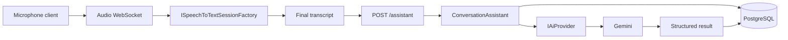

# Conversa

Conversa is an AI-powered conversation assistant for people who need to understand and take part in a spoken conversation in a foreign language.

The first scenario is a Turkish speaker listening to English:

1. The app receives a transcript of what the other person said.
2. The AI translates and, when useful, explains that speech in natural Turkish.
3. If the speaker asks the user a question, the AI can detect that.
4. When the active instruction allows it, the AI suggests a natural English reply and shows what that reply means in Turkish.
5. The user can also type a Turkish request and ask the AI to formulate it in natural English.

Conversa is not a generic translator. Every request is interpreted against the current conversation and that conversation's instruction. The instruction stays in force until the user changes it.

Example instruction:

> During this conversation, translate the English speaker's speech into natural and accurate Turkish. Unless I explicitly ask otherwise, only translate and explain what is being said.

Later, for the same conversation:

> From now on, also detect questions directed at me and suggest natural English answers.

The new instruction replaces the previous one for that conversation only.

## Current status

This repository is the first foundation step. It is a modular monolith, not a set of microservices, and it does not yet include a web or mobile client.

Working now:

- Conversation create, read, update, and delete, scoped to an authenticated user id
- Persistent instruction, title, and language pair on each conversation
- Changing the instruction during a conversation, with a system note in the transcript
- Message history that can be reopened later
- Assistant endpoint that sends the transcript, recent turns, and the active instruction to the AI
- Gemini provider behind `IAiProvider`, returning a structured result rather than free text
- Honest failure when the Gemini API key is missing (no fabricated translation)
- PostgreSQL persistence through Entity Framework Core, including the initial migration
- Deepgram speech-to-text provider with one-shot transcription and a streaming session adapter
- WebSocket entry point for continuous listening that reports when speech-to-text is not configured
- JWT Bearer validation and an authenticated session endpoint for web clients
- React web authentication/session flow with short-lived memory-only access tokens and a persistent HttpOnly browser session

Not implemented yet:

- Identity provider / user credential issuance
- React Native client
- A full microphone pipeline in the web client
- Production deployment configuration is included for Render; the production service itself is provisioned outside GitHub
- A model snapshot for later `dotnet ef migrations add` diffs (see below)

## Architecture

One ASP.NET Core host. Domain rules stay in the domain project. Use cases live in the application project. PostgreSQL and Gemini live in infrastructure. The API project is the composition root.

```text
src/
  Conversa.Domain/            entities and invariants
  Conversa.Application/       use cases and provider interfaces
  Conversa.Infrastructure/    EF Core, Gemini, repositories
  Conversa.Api/               HTTP, WebSocket, composition root
```

Feature boundaries inside those projects:

| Module | Responsibility |
| --- | --- |
| Conversation | Persistent conversation, instruction, languages |
| Messages | Turns stored against a conversation |
| AI | Provider-neutral request and structured response |
| Speech-to-text | One-shot and streaming transcription contracts |
| Audio | Chunk shape used by the streaming boundary |
| Authentication | JWT validation, authenticated current-user context, and session endpoint |

Provider-specific prompt text and HTTP calls stay in `Conversa.Infrastructure`. Application code depends on `IAiProvider`, not on Gemini types.


```mermaid
flowchart LR
  Mic[Microphone client] --> Ws[Audio WebSocket]
  Ws --> Stt[ISpeechToTextSessionFactory]
  Stt --> Transcript[Final transcript]
  Transcript --> Api["POST /assistant"]
  Api --> App[ConversationAssistant]
  App --> Db[(PostgreSQL)]
  App --> Ai[IAiProvider]
  Ai --> Gemini[Gemini]
  Gemini --> Result[Structured result]
  Result --> Db
```

The WebSocket does not invent transcripts. Until a speech-to-text provider is registered, it accepts the socket and returns `stt_provider_not_configured`. Final text is posted to the assistant endpoint, which loads the conversation instruction and recent messages before calling the AI.

## Technology stack

- .NET 10 / ASP.NET Core Web API
- C# with nullable reference types
- Entity Framework Core 10 and Npgsql for PostgreSQL
- React web client is present; React Native is planned
- Gemini as the first `IAiProvider`
- Speech-to-text is an interface only, so the vendor can be chosen later

## Domain

`Conversation`

- Id, UserId, Title, Instruction, SourceLanguage, TargetLanguage, CreatedAt, UpdatedAt

`Message`

- Id, ConversationId, Role, OriginalText, Translation, Explanation, SuggestedAnswer, SuggestedAnswerTranslation, CreatedAt
- Also stored, so a reopened conversation keeps the structured result: ResponseType, QuestionDetected, QuestionDirectedAtUser, ProviderName

Languages are BCP-47 tags (`en`, `tr`), not an English/Turkish enum. The AI model uses `Translation` for the target language. In the initial scenario that text is Turkish. The conceptual fields map like this:

| Conceptual field | Stored property |
| --- | --- |
| original | OriginalText |
| turkish | Translation |
| explanation | Explanation |
| suggestedAnswer | SuggestedAnswer |
| suggestedAnswerTurkish | SuggestedAnswerTranslation |
| type | ResponseType (`translation`, `question`, `answer`, `instruction`) |

`MessageRole` is `speaker` for overheard speech, `user` for a formulation request, and `system` for notes such as an instruction change.

## AI behavior

`POST /api/conversations/{id}/assistant` builds an `AiConversationRequest` from:

- the active instruction
- source and target languages
- the latest text
- the input kind: `heardSpeech` or `userFormulationRequest`
- the latest conversation turns

Gemini is asked for JSON that matches a fixed schema. The parser rejects empty or non-JSON results. It does not fill in a translation of its own.

If `Gemini:ApiKey` is empty, the endpoint returns HTTP 503. Conversation CRUD still works.

The instruction is natural language, so the provider is what interprets "only translate" versus "also suggest answers". The application always sends the instruction currently stored on the conversation.

## Speech and audio

Two replaceable contracts live in the application layer:

- `ISpeechToTextProvider` for a completed audio payload
- `ISpeechToTextSessionFactory` / `ISpeechToTextSession` for a continuous chunk stream

Deepgram is the first concrete speech-to-text provider. It is enabled only when `Deepgram:ApiKey` is configured. The provider adapter stays in `Conversa.Infrastructure`; the application layer remains vendor-neutral.

Deepgram credentials are read from `Deepgram__ApiKey` in the environment (or the equivalent ASP.NET Core configuration source). The key is never committed or returned by the API.

The one-shot provider uses Deepgram's `/v1/listen` endpoint. The streaming adapter uses Deepgram's secure WebSocket listen endpoint with interim results and endpointing enabled. Deepgram's current live API supports binary media messages and returns JSON results with `is_final` and `speech_final` flags. citeturn734035search0turn734035search2

Until `Deepgram:ApiKey` is configured, `GET /api/speech/provider` reports no configured STT provider and the audio WebSocket keeps its existing `stt_provider_not_configured` behavior.

The WebSocket route is:

```text
/ws/conversations/{conversationId}/audio
```

The real Deepgram provider smoke test is manual because it makes a live external API request. It uses Deepgram's published English WAV sample and requires the `DEEPGRAM_API_KEY` GitHub Actions secret. citeturn635016search0turn667825search0

Authentication uses a validated Bearer JWT. The authenticated user id is taken from the token's `NameIdentifier`/`sub` claim. Binary WebSocket frames are audio chunks. They are not transcribed until a session factory is registered.

## How to run the backend

Requirements:

- .NET SDK 10 or newer
- PostgreSQL 16 or newer

Start PostgreSQL:

```bash
docker compose up -d
```

The compose file reads PostgreSQL credentials from `.env`. Copy `.env.example` to `.env` and keep the populated file untracked.

Apply configuration and run the API:

```bash
cp .env.example .env
# Edit .env with local values.
set -a
source .env
set +a
export ASPNETCORE_ENVIRONMENT=Development
export ASPNETCORE_URLS="http://localhost:5080"
dotnet run --project src/Conversa.Api

For Windows PowerShell, set the same ASP.NET Core configuration values as environment variables or use dotnet user-secrets; the application does not load .env files automatically.
```

In Development the API applies EF Core migrations on startup. Open `http://localhost:5080/health` and `http://localhost:5080/`.

Build without running:

```bash
dotnet build Conversa.slnx
```

### Authentication

Conversation and assistant routes require a valid short-lived JWT access token. The repository validates issuer, audience, signing key, and token lifetime; it does not issue the user's original identity credentials.

The web client accepts an access token issued by the configured identity system and exchanges it with:

```text
POST /api/auth/session
Authorization: Bearer <externally-issued-token>
```

The API then returns a short-lived Conversa access token and sets a persistent `HttpOnly` session cookie. The access token stays in JavaScript memory only; it is never written to `localStorage` or `sessionStorage`.

After a page reload, the web client calls:

```text
POST /api/auth/refresh
```

using the browser-managed cookie and receives a fresh short-lived access token. When a protected API call receives HTTP 401, the client performs one bounded refresh attempt and retries the original request once.

Signing out calls:

```text
POST /api/auth/logout
```

which clears the persistent session cookie and the in-memory access token.

For the command examples below, set an externally issued token first:

```bash
export ACCESS_TOKEN="issued-by-your-identity-system"
```

Do not commit or print a real token.

### Example calls

Create a conversation:

```bash
curl -X POST http://localhost:5080/api/conversations \
  -H "Content-Type: application/json" \
  -H "Authorization: Bearer ${ACCESS_TOKEN}" \
  -d '{
    "title": "Hotel check-in",
    "instruction": "During this conversation, translate the English speaker'\''s speech into natural and accurate Turkish. Unless I explicitly ask otherwise, only translate and explain what is being said.",
    "sourceLanguage": "en",
    "targetLanguage": "tr"
  }'
```

Change the instruction:

```bash
curl -X PATCH http://localhost:5080/api/conversations/{id} \
  -H "Content-Type: application/json" \
  -H "Authorization: Bearer ${ACCESS_TOKEN}" \
  -d '{"instruction":"From now on, also detect questions directed at me and suggest natural English answers."}'
```

Send overheard English:

```bash
curl -X POST http://localhost:5080/api/conversations/{id}/assistant \
  -H "Content-Type: application/json" \
  -H "Authorization: Bearer ${ACCESS_TOKEN}" \
  -d '{"inputKind":"heardSpeech","text":"Could you tell me a bit about yourself?"}'
```

Ask for an English formulation from Turkish:

```bash
curl -X POST http://localhost:5080/api/conversations/{id}/assistant \
  -H "Content-Type: application/json" \
  -H "Authorization: Bearer ${ACCESS_TOKEN}" \
  -d '{"inputKind":"userFormulationRequest","text":"Geç çıkış yapmak istiyorum, nazikçe sor."}'
```

## Environment variables

ASP.NET Core maps `__` to configuration sections. See `.env.example`.

| Variable | Required | Purpose |
| --- | --- | --- |
| `ConnectionStrings__DefaultConnection` | Yes outside Development/Testing | PostgreSQL connection string |
| `Gemini__ApiKey` | Required to call the assistant | Gemini API key. Never commit this |
| `Gemini__Model` | No | Defaults to `gemini-3.8-flash` |
| `Gemini__BaseUrl` | No | Defaults to `https://generativelanguage.googleapis.com/` |
| `Deepgram__ApiKey` | Required to enable STT | Deepgram API key. Never commit this |
| `Deepgram__Model` | No | Defaults to `nova-3` |
| `Deepgram__BaseUrl` | No | Defaults to `https://api.deepgram.com` |
| `Deepgram__EndpointingMilliseconds` | No | Defaults to `300` |
| `RateLimiting__RedisConnectionString` | Yes outside Development/Testing | Shared Valkey/Redis endpoint |
| `Authentication__Issuer` | Yes outside Development/Testing | JWT issuer |
| `Authentication__Audience` | Yes outside Development/Testing | JWT audience |
| `Authentication__SigningKey` | Yes outside Development/Testing | Base64 signing secret, at least 32 bytes |
| `Cors__AllowedOrigins` | Yes outside Development/Testing | Exact HTTPS browser origins, comma-separated |
| `Observability__Enabled` | No | Enables OpenTelemetry export; defaults to `false` |
| `Observability__ServiceName` | When observability is enabled | OTLP resource service name |
| `Observability__OtlpEndpoint` | No | OTLP collector endpoint; HTTPS required outside Development/Testing when set |


`appsettings.json` contains only non-secret defaults. `appsettings.Development.json` is intentionally empty so local credentials cannot live in source control. Local secrets belong in `.env`/user-secrets or environment variables. Production must provide all required settings and must not run as Development.

### OpenTelemetry

Conversa uses OpenTelemetry for HTTP request tracing/metrics and custom AI, speech-to-text, and audio WebSocket telemetry. Set `Observability__Enabled=true` and `Observability__OtlpEndpoint` to an OTLP collector endpoint to export telemetry. The same endpoint is used for traces and metrics. Telemetry tags contain only low-cardinality operational metadata such as provider, operation and outcome; prompts, transcripts, tokens, API keys, credentials and conversation identifiers are not added to custom telemetry.

The application also enables HttpClient instrumentation when observability is enabled, so outbound provider calls can be correlated with the incoming request trace without recording request or response bodies.

### GitHub Actions Gemini secret

The repository secret `GEMINI_API_KEY` is mapped by GitHub Actions to the ASP.NET Core configuration variable `Gemini__ApiKey`. The application provider reads that configuration value at runtime and sends it to the Gemini API as the `x-goog-api-key` request header. The integration workflow runs a real Gemini smoke test on pushes to `main` and via manual dispatch; the secret value is never written to the repository or printed to logs.

User secrets are also supported:

```bash
dotnet user-secrets set "Gemini:ApiKey" "your-gemini-api-key" --project src/Conversa.Api
```

## Production deployment

The API is deployed as a prebuilt GHCR image to Render by the controlled `.github/workflows/deploy-production.yml` workflow. The deployment uses the exact GHCR image tag supplied to the workflow, runs the EF migration bundle before traffic is switched, and verifies `/health` plus `/health/ready` over HTTPS.

Render configuration lives in `render.yaml`. Production secrets remain in Render and GitHub environment configuration rather than source control. See [documentation/deployment.md](documentation/deployment.md) for the one-time setup, deployment, and rollback procedure.

Render supports image-backed web services pulling private images from GHCR, HTTP health checks, and deploy hooks for controlled image deployment. citeturn597444search0turn165385search1

## Hosted PostgreSQL with Neon

Conversa can use Neon as its hosted PostgreSQL database without changing the EF Core/Npgsql persistence layer.

The application continues to read the database connection from `ConnectionStrings:DefaultConnection`, which maps to the `ConnectionStrings__DefaultConnection` environment variable. For local development, the committed Development configuration keeps the Docker PostgreSQL fallback.

For a hosted environment, set the application connection to the Neon pooled connection string. Keep both Neon connection strings outside source control:

- `NEON_DATABASE_URL`: pooled connection string for normal application traffic.
- `NEON_DATABASE_URL_UNPOOLED`: direct/unpooled connection string for schema migration and database administration tasks.

Neither value belongs in the repository. GitHub Actions uses repository secrets with the same names.

The Neon integration workflow runs on pull requests to `main`. It first checks the pooled connection, then applies the existing EF Core migrations through the unpooled connection and verifies conversation/message persistence against the real Neon database. The CRUD assertions run inside a transaction and roll back the test data after verification.

The current schema is created by the existing `InitialCreate` migration; no new migration is required just to switch from local PostgreSQL to Neon.

## Database migration

The initial migration is `src/Conversa.Infrastructure/Persistence/Migrations/20260922223000_InitialCreate.cs`.

The Infrastructure and API projects reference `Microsoft.EntityFrameworkCore.Design`, and the repository can use the version-pinned `dotnet-ef` CLI for explicit migration operations. The design-time `AppDbContextFactory` reads only `ConnectionStrings__DefaultConnection`, so EF commands do not need to start the full API or expose application credentials in source code.

For local development, point `ConnectionStrings__DefaultConnection` at the Docker PostgreSQL instance and run:

```bash
dotnet tool install --global dotnet-ef --version 10.0.11
dotnet ef database update --project src/Conversa.Infrastructure --startup-project src/Conversa.Api
```

For hosted Neon, use the **Neon database migration** GitHub Actions workflow. It reads `NEON_DATABASE_URL_UNPOOLED` from repository secrets, applies the latest migration with `dotnet ef database update`, and then runs the existing Neon integration test to verify the migrated schema and conversation/message persistence. The workflow is manual by design so a schema-changing operation is explicit rather than triggered on every push.

A model snapshot is not currently checked in. Before adding a second migration, the EF model/migration setup should be reviewed and the snapshot generated as part of that migration workflow.

## Replacing a provider

AI: implement `IAiProvider` and register it instead of `GeminiAiProvider` in `AddInfrastructure`. Do not reference the new SDK from `Conversa.Application` or `Conversa.Domain`.

Speech: implement `ISpeechToTextSessionFactory` and register it. The WebSocket host already opens a session, appends binary frames, and forwards partial and final transcript events. It does not call the assistant automatically. The client posts the final transcript to `/assistant` so the instruction and conversation context stay in one place.
